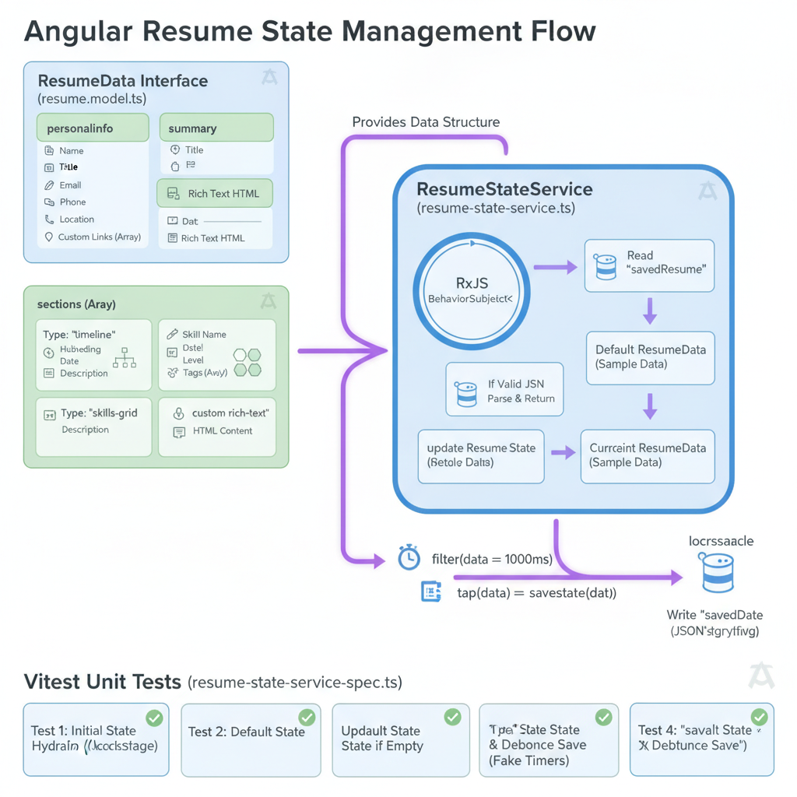
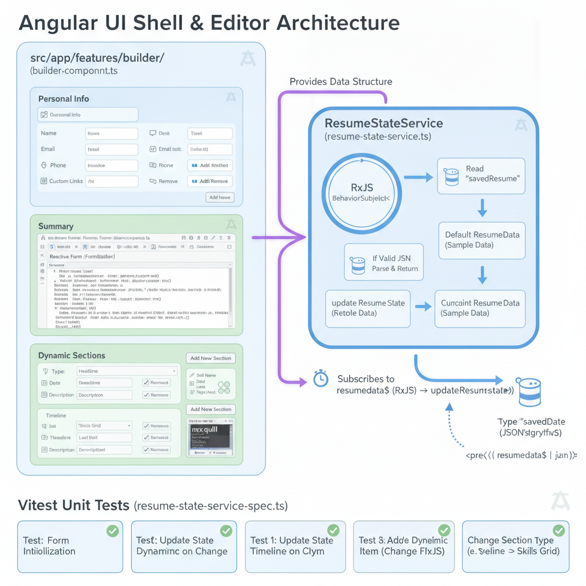
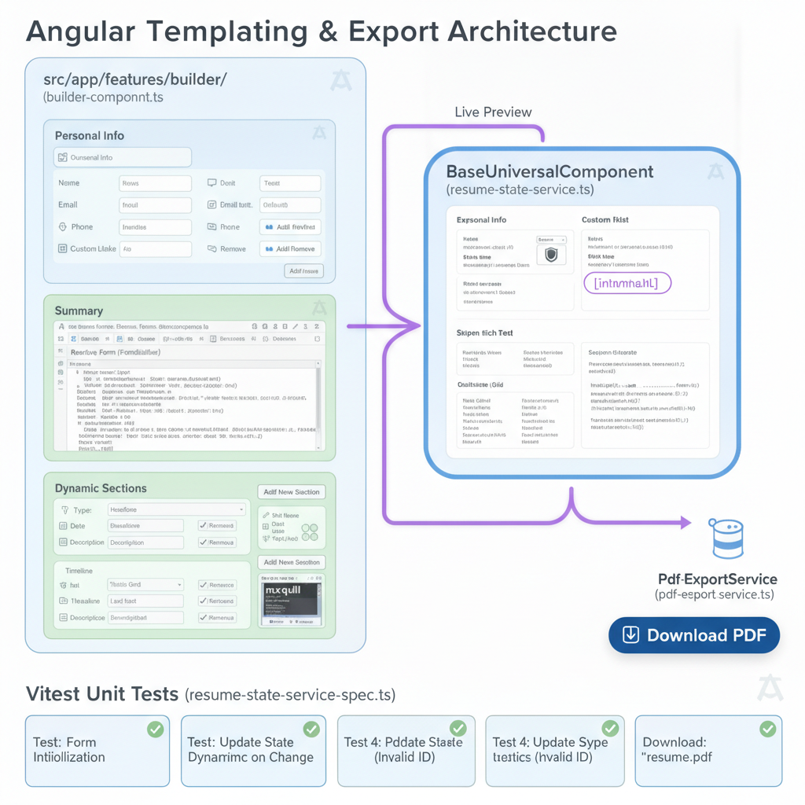

# Architecture Overview (arc42)

## 1. Introduction and Goals

The Resume Builder is a privacy-first, zero-backend tool. All data processing and PDF generation occur in the user's browser via `localStorage` and client-side canvas rendering.

## 2. Building Block View

- **Core (State Management)**: `ResumeStateService` handles reactive state using RxJS and debounced persistence.
- **Features (UI/UX)**:
  - `Builder`: Parent shell for layout.
  - `FormEditor`: Dynamic Reactive Form engine using `ngx-quill`.
  - `LivePreview`: Reactive display layer.
- **Templates**: `BaseUniversalComponent` handles the A4 print rendering.
- **Infrastructure**: `PdfExportService` wraps `html2pdf.js` for document generation.

## 3. Data Flow

_The data flow is unidirectional: User Input -> FormEditor -> ResumeStateService (Update) -> LivePreview (Render)._

## 4. Deployment View

This is a static web application. It is optimized for deployment on global CDNs like Vercel or Netlify via `ng build`.
