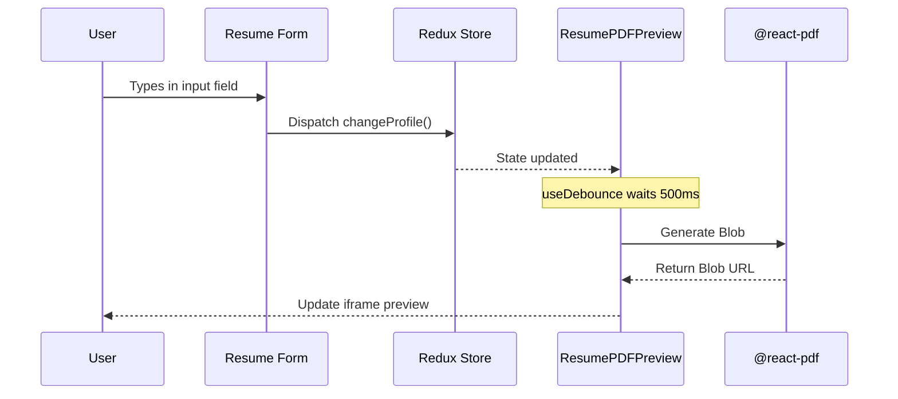

# Serverless Resume Builder - arc42 Architecture Documentation

## 1. Introduction and Goals

The Serverless Resume Builder is a free, privacy-first web application that allows users to create, preview, and download ATS-friendly PDF resumes.

### Quality Goals

1. **Privacy**: All processing (parsing and PDF generation) must happen locally in the browser.
2. **Performance**: Live preview rendering must be fast and not block the main thread.
3. **Usability**: The builder must be intuitive, with real-time feedback and easy-to-use templates.

## 2. Architecture Constraints

- **Framework**: Next.js App Router (React).
- **No Backend**: The system must not rely on any backend database or API for core functionality.
- **Client-Side Generation**: PDFs must be generated via JavaScript in the browser.

## 3. System Scope and Context

The system interacts solely with the End User and their local environment.

```mermaid
contextDiagram
  User --> (Resume Builder App) : Inputs data / Uploads PDF
  (Resume Builder App) --> (Local Storage) : Persists State
  (Resume Builder App) --> User : Returns PDF Download
```

## 4. Solution Strategy

- **UI Framework**: React within Next.js.
- **Styling**: Tailwind CSS for rapid, utility-first styling.
- **State Management**: Redux Toolkit for complex, deeply nested state (forms, settings) with `localStorage` persistence.
- **PDF Generation**: `@react-pdf/renderer` for robust, pixel-perfect PDF creation.

## 5. Building Block View

### Level 1: System Context

The core application consists of two main pillars: the **Builder UI** (Form) and the **Preview Engine** (PDF).

### Level 2: Core Components

```mermaid
graph TD
  A[Next.js App] --> B[Redux Store]
  A --> C[Resume Form]
  A --> D[Resume Preview]
  A --> E[PDF Parser Engine]

  C --> B : Dispatches actions (user typing)
  E --> B : Dispatches extracted PDF data

  B --> D : Supplies state for rendering
  D --> F[@react-pdf/renderer] : Triggers Blob creation
```

## 6. Runtime View

### Live Preview Update Flow



## 7. Deployment View

The application is a standard Next.js build. It is optimized for Edge deployment on Vercel or Netlify.
Since it requires no backend infrastructure, the deployment is a static export or basic Next.js serverless functions (for page routing).

## 8. Cross-cutting Concepts

### State Hydration

Because the app relies heavily on `localStorage`, Redux initialization involves a hydration step to prevent Next.js SSR hydration mismatches. Initial render uses empty state, and a `useEffect` hook loads the persisted state immediately after mount.

### Theming

The application supports a toggleable Dark/Light mode, orchestrated via Tailwind's `darkMode: 'class'` and semantic CSS variables defined in `globals.css`.

## 9. Architectural Decisions

See the `docs/adr/` directory for historical context on technical choices:

- `0001-use-react-pdf-for-document-generation.md`
- `0002-migrate-from-angular-to-nextjs.md`
- `0003-client-side-only-architecture.md`

## 10. Quality Requirements

- **Offline Capability**: Once the application is loaded, a user should theoretically be able to generate a PDF without an active internet connection (minus external web fonts).

## 11. Risks and Technical Debt

- **Bundle Size**: `@react-pdf/renderer` and its dependencies are large. It is dynamically imported to mitigate impact on initial load, but still poses a risk for low-bandwidth users.
- **Parsing Accuracy**: The heuristic ATS parser is an ongoing maintenance burden as new resume formats emerge.

## 12. Glossary

- **ATS**: Applicant Tracking System.
- **FOUC**: Flash of Unstyled Content (relevant to our dark mode implementation).
- **React-PDF**: Refers specifically to `@react-pdf/renderer` (not to be confused with libraries that render PDFs to HTML canvas).
